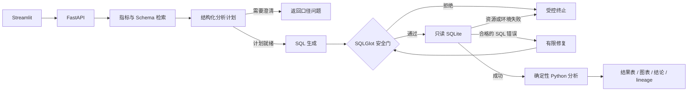

# 电商经营分析 Agent

**用自然语言查询经营数据，以业务口径、安全 SQL 和确定性计算约束模型输出。**

面向公开 Olist 电商数据的个人作品集项目。用户可以查询 GMV、订单与客户指标，
进行月度比较、品类贡献分析和规则型异常检测；系统返回 SQL、结果表、图表、
计算结论与运行追踪。已实现 FastAPI + Streamlit 本地演示和三个版本的真实模型评测。

**6 张核心表 · 38 个字段 · 27 项指标口径定义 · 60 道冻结评测题 · 468 项离线测试**

[快速运行](docs/QUICKSTART.md) · [工程设计与代码导航](docs/ENGINEERING.md) ·
[真实实验报告](docs/evaluation/experiment_report.md) · [文档索引](docs/README.md)

## 项目解决什么问题

电商分析中，“销售额”可能指商品 GMV、含运费成交额或支付金额；一对多表直接
JOIN 会重复计数；SQL 能执行也可能用错客户标识或比较不完整月份。本项目将这些
问题放进指标字典、执行边界和结果合同，减少对模型自由判断的依赖。

| 用户需求 | 已实现的处理方式 |
| --- | --- |
| “2018 年 7 月已送达订单 GMV 是多少？” | 检索指标定义、生成带命名参数的 SQL、只读执行并返回结果 |
| “比较 2018 年 7 月与 6 月的 GMV。” | SQL 取数后由 Python 计算变化，保留缺期、零基期和完整性状态 |
| “哪些品类贡献了最多 GMV？” | 校验分子与分母的指标、期间、筛选和粒度，保留未知品类 |
| “这个月是否异常？” | 使用历史窗口 median/MAD 检测偏离，区分样本不足与可计算状态 |
| “分析销售额。” | 返回需要澄清的指标口径，不直接选择一个金额定义 |
| 越权查询、写入 SQL 或昂贵查询 | AST 安全门、计划范围、只读数据库、行数与时间限制分别控制 |

数据使用 Olist 公开数据，查询范围是本项目的六张核心表。当前数据没有平台/渠道字段；
指标字典也保留了无法由现有数据计算的指标边界。[数据来源与许可](docs/DATASET.md)

## 系统架构



工作流由显式状态机统一管理，检索、规划、生成、安全、执行、分析、展示等节点
声明前置条件与可写字段。LangGraph 映射层复用同一套节点逻辑；本地演示入口
使用普通 Python 状态机。每次请求保留统一 `run_id`，计算结果连接到实际 SQL attempt。

技术栈：**Python 3.11、Pydantic、pandas、SQLGlot、SQLite、FastAPI、Streamlit**；
模型适配器为 DeepSeek，另提供 LangGraph 工作流映射与 Docker/Compose 离线复现配置。

## 一条请求的实际输出

问题：**比较 2018 年 7 月与 6 月的已送达月度 GMV 环比。**

| 月份 | 已送达商品 GMV（原数据金额单位） |
| --- | ---: |
| 2018-06 | 856,077.86 |
| 2018-07 | 867,953.46 |

Python 计算的绝对变化为 **11,875.60**，相对变化为 **+1.3872%**。
API 响应同时包含 `status`、`run_id`、SQL、命名参数、表格、图表规范、
`calculation_status`、停止原因和计算输入哈希。

这一示例由**固定规划/SQL 测试输入 + 真实本地 Olist SQLite** 离线执行产生，
展示查询、计算与 API 链路，模型调用为 0。真实模型效果见下一节。
[完整响应 JSON](docs/examples/monthly_gmv_response.json)

## 关键工程设计

| 设计 | 实现与验证入口 |
| --- | --- |
| 唯一指标语义源 | [指标字典](data/metadata/metric_dictionary.csv)定义公式、粒度、维度与限制；[MetricCatalog](src/ecommerce_agent/metric_catalog.py)校验结构化计划 |
| 两层 SQL 授权 | [SQL 安全门](src/ecommerce_agent/sql_safety.py)取全局 Schema 与本次计划范围的交集，解析 CTE、别名、字段和查询类型 |
| 执行层防护 | [SQL 执行器](src/ecommerce_agent/sql_generation.py)使用只读 URI、`query_only`、命名参数、行数上限与 SQLite 超时中断 |
| 有边界的修复 | [修复工作流](src/ecommerce_agent/repair_workflow.py)仅处理合格 SQL 错误，重新校验候选，以次数和重复 SQL 哈希停止循环 |
| 可追溯数值计算 | [环比/同比](src/ecommerce_agent/period_comparison.py)、[异常检测](src/ecommerce_agent/anomaly_detection.py)由 Python 计算，记录输入哈希和 SQL 来源 |
| 状态与服务解耦 | [状态机](src/ecommerce_agent/workflow.py)、[API 映射](src/ecommerce_agent/response_mapping.py)和[页面](src/ecommerce_agent/ui.py)分离业务执行与展示 |
| 有预算的模型调用 | [预算账本](src/ecommerce_agent/model_budget.py)对调用、token 和保守成本设置硬限额，区分模型传输尝试与 SQL 尝试 |
| 先封存、后评分 | [评测隔离](src/ecommerce_agent/reproducibility.py)保存候选与哈希后才开放参考评分，区分真实模型、假模型与评分器回放 |

设计取舍、典型失败及对应测试见[工程设计与代码导航](docs/ENGINEERING.md)。

## 真实模型评测

对同一套 60 题比较直接 SQL、检索 + SQL 和完整 Agent，使用 DeepSeek
`deepseek-flash`，temperature 0，thinking disabled。题目包含 20 道单指标、
20 道聚合/筛选/多表、10 道确定性分析和 10 道危险/歧义/不可回答问题。

| 指标 | 直接 SQL | 检索 + SQL | 完整 Agent |
| --- | ---: | ---: | ---: |
| SQL 执行成功 | 44/60 | 47/60 | 45/60 |
| 结果正确（可评估题） | 0/51 | 16/53 | **26/52** |
| 完整逐题契约通过 | 6/60 | 22/60 | **25/60** |
| 工作流状态正确 | 49/60 | **50/60** | 39/60 |
| 平均端到端延迟 | 12.96 s | 13.50 s | 26.63 s |

在共同可评估的 52 题上，完整 Agent 相对检索版的结果正确率差异为
**+19.2 个百分点**，配对 bootstrap 95% 区间为 `[+7.7, +30.8]`。
同时，状态正确率退化、延迟增加，说明增加工作流环节也会引入新的失败路径。

主实验共 **229 次模型调用、783,506 tokens**；保守费用估算为 **$0.2651**，
不是供应商最终账单。三个版本使用各自可评估题数作为结果分母；完整契约还要求
状态、计算、停止原因等合同同时满足，因此不能将 `26/52` 当作端到端成功率。

题集为项目内构建并冻结，业务答案没有独立金标准；单模型单次运行也不能代表
生产请求分布。主实验未触发修复调用，修复收益仍由离线机制测试覆盖。
[结构化结果](docs/reports/model_comparison.json) · [配对统计与实验解释](docs/evaluation/experiment_report.md) ·
[18 个真实代表失败案例](docs/evaluation/model_failures.md)

## 运行与验证

环境：Python **3.11.9**。克隆仓库后，按[快速运行说明](docs/QUICKSTART.md)创建
虚拟环境、安装已记录的依赖、下载公开数据并建立数据库，再启动两个本地进程：

```powershell
# 终端 1：API；先在此进程的环境中配置 DEEPSEEK_API_KEY
.\.venv\Scripts\python.exe -m uvicorn src.ecommerce_agent.live_runtime:create_live_app --factory --host 127.0.0.1 --port 8000

# 终端 2：页面
.\.venv\Scripts\python.exe -m streamlit run streamlit_app.py --server.address 127.0.0.1 --server.port 8501
```

页面：`http://127.0.0.1:8501/`；API 文档：`http://127.0.0.1:8000/docs`。
真实交互会调用模型；模型凭据仅从进程环境读取。预算、离线检查与数据准备方法
均在快速运行说明中列出。

无需 API Key 或下载完整数据，也可以先验证结构化计划、服务装配和澄清路径：

```powershell
.\.venv\Scripts\python.exe -m pytest -q tests/test_analysis_plan.py tests/test_live_runtime.py
```

2026-10-04，本地完整数据环境的全量测试为 **468 passed**，有 1 条依赖弃用提示；
`pip check`、compileall、真实 SQLite 离线检查和冻结输入哈希核验通过。
Docker/Compose 的配置检查已通过，容器实际 build/run 尚未验证。

## 仓库导航

```text
src/ecommerce_agent/    语义层、SQL、安全、分析、工作流、API 与评测
tests/                 单元、服务集成、页面与真实 SQLite 离线测试
sql/                   表结构与参考经营 SQL
data/metadata/         指标、维度、数据库字典与数据文件清单
data/evaluation/       冻结评测题、公开题面与评分参考
docs/examples/         带来源标记的实际 API 输出示例
docs/evaluation/       实验设计、真实模型对比与失败分析
docs/reports/          结构化实验结果和验证证据
docs/validation/       各组件的验证范围与验收记录
```

组件职责和阅读顺序见[工程导航](docs/ENGINEERING.md)。更多证据见[文档索引](docs/README.md)，
维护与发布方法见[GitHub 更新说明](docs/GITHUB_PUBLISHING.md)。
